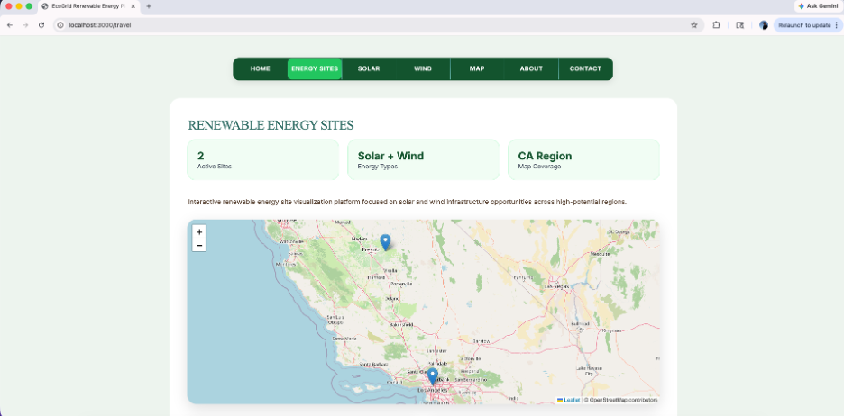
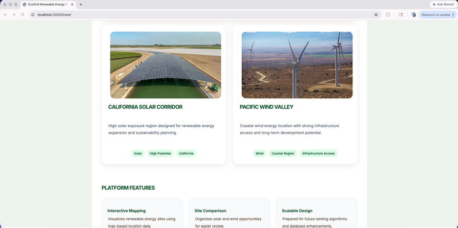
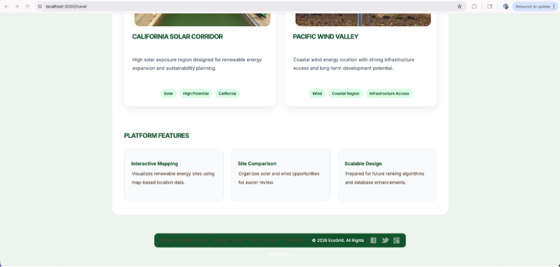
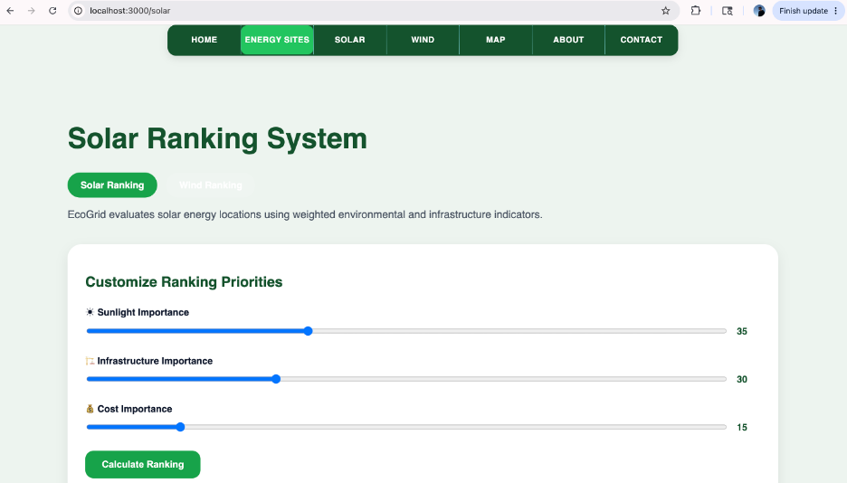
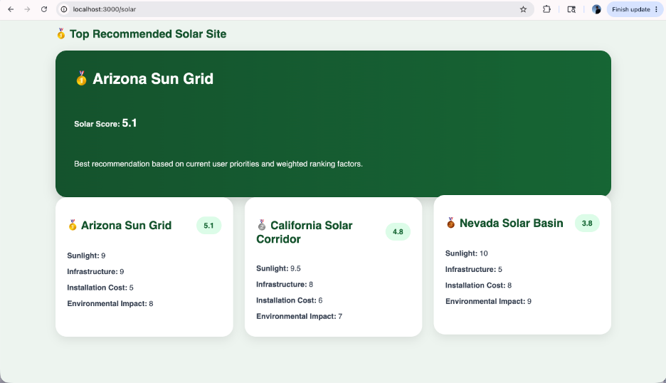
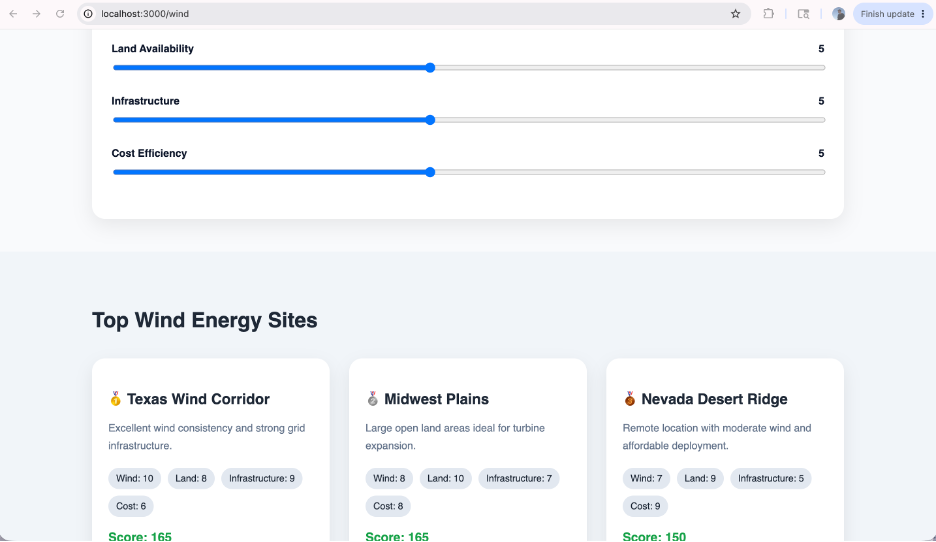
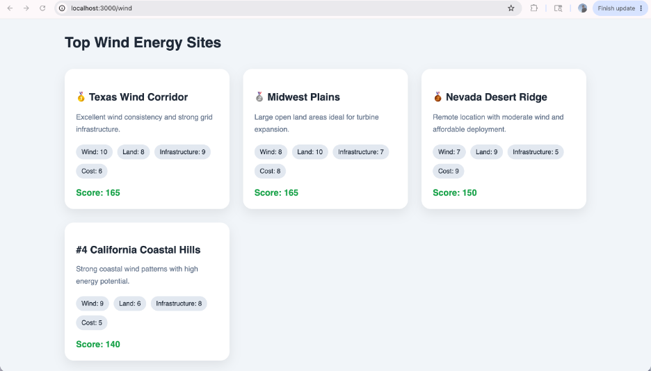
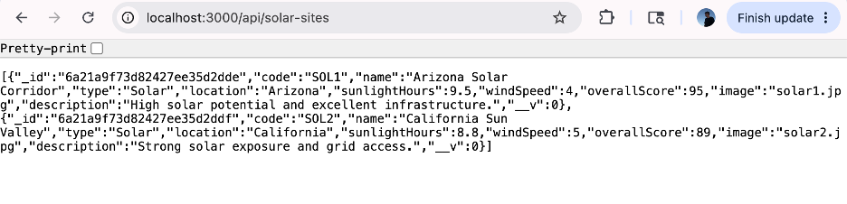
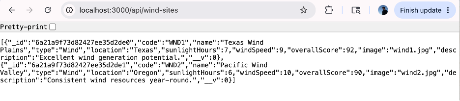
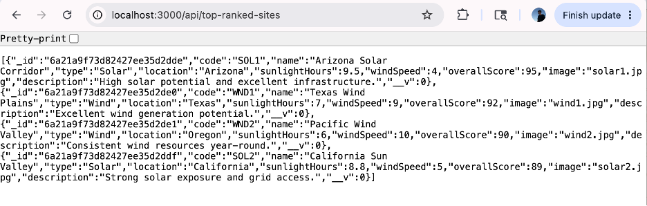

# Jorge Fernando Moreno Jacob

### Computer Science Student | Software Engineering | Full Stack Development | Secure Coding

---

# Professional Self-Assessment

Throughout my Bachelor of Science in Computer Science program at Southern New Hampshire University, I have developed technical and professional skills that have prepared me for a career in software engineering. The coursework completed throughout the program allowed me to strengthen my abilities in software development, secure coding, databases, algorithms, communication, and collaboration while working on projects that simulated real-world industry environments.

One of the most valuable lessons I learned during the program was the importance of collaboration and communication. Courses involving software development life cycle methodologies and team-based projects helped me understand how developers, stakeholders, and end users work together to build successful software solutions. These experiences taught me how to communicate technical concepts clearly and adapt solutions to meet organdpizational and user needs.

The program also strengthened my understanding of software engineering principles. Through coursework involving object-oriented programming, software architecture, secure coding, testing, databases, algorithms, and full stack development, I learned how to design, implement, evaluate, and improve software systems.

The EcoGrid project represents the integration of multiple areas of computer science. The software engineering enhancement transformed an existing full-stack application into a renewable energy platform with improved usability, scalability, and interactive mapping. The algorithms enhancement introduced dynamic recommendation systems for solar and wind energy site selection. The database enhancement redesigned the MongoDB data model and implemented specialized queries to support renewable energy analysis.

Another important area of growth throughout the program was software security. Through coursework in secure coding and software security, I developed a security mindset by learning vulnerability assessment, dependency management, authentication concepts, secure design principles, risk mitigation, and data protection practices. These experiences reinforced the importance of designing software systems that anticipate potential threats while protecting data and resources.

Originally, I entered the program with a strong interest in web development. As I progressed through the curriculum, I realized that I could combine my previous background in Biological Sciences with Computer Science and pursue opportunities in renewable energy technology. The EcoGrid platform reflects this goal by combining software engineering, algorithms, databases, and sustainability-focused decision support systems.

Together, the artifacts included in this ePortfolio demonstrate my ability to apply computer science concepts to practical problems while balancing usability, performance, maintainability, scalability, and security. They represent my growth as a software developer and my readiness to continue learning, pursue graduate studies, and contribute to innovative technologies within the renewable energy industry.

---

# About Me

Hello! My name is Jorge Jacob, and I am currently pursuing a Bachelor of Science in Computer Science with a concentration in Software Engineering at Southern New Hampshire University.

My interests include:

* Full Stack Development
* Secure Coding and Software Security
* GIS
* Renewable Energy Technology
* Web Design and User Experience
* Databases and APIs
* Mobile Application Development

Throughout my academic journey, I have developed projects involving C++, JavaScript, Node.js, Angular, MongoDB, Android Studio, Python, and Raspberry Pi systems. I enjoy combining creativity with technology to build applications that are both functional and user-friendly.

---

# Technical Skills

## Languages

* C++
* JavaScript
* Python
* Java
* HTML/CSS
* SQL

## Frameworks & Technologies

* Node.js
* Angular
* Express.js
* MongoDB
* REST APIs
* JWT Authentication
* Android Studio
* Raspberry Pi
* Git & GitHub

## Development Areas

* Full Stack Development
* Secure Coding
* Software Engineering
* API Development
* Database Design
* Embedded Systems
* Mobile Development

---

# CS 499 Computer Science Capstone

## EcoGrid Renewable Energy Site Selection Platform

EcoGrid is a full-stack renewable energy intelligence platform developed as the centerpiece of my Computer Science Capstone project.

The platform demonstrates the integration of:

* Software Engineering
* Algorithms and Data Structures
* Database Design
* Full Stack Development
* Secure Coding Practices
* Renewable Energy Analysis

The goal of EcoGrid is to help users evaluate and compare renewable energy opportunities by combining visualization tools, ranking systems, database technologies, and modern web development practices.

---

# Original Artifact

## Travlr Full Stack Application

The original artifact selected for this capstone project was the Travlr full-stack web application developed during CS 465 Full Stack Development I.

The original application focused on:

* Travel destinations
* Resort information
* Pricing details
* Tourism content
* MongoDB integration
* Full-stack architecture

While the project successfully demonstrated full-stack development concepts, it lacked advanced decision-making tools, renewable energy analysis capabilities, and specialized database structures.

This artifact served as the foundation for all capstone enhancements.

---

# Enhanced Artifact

## EcoGrid Renewable Energy Site Selection Platform

The enhanced artifact transformed the original Travlr application into a renewable energy intelligence platform designed to support renewable energy site evaluation and analysis.

EcoGrid allows users to:

* Explore renewable energy locations
* Visualize energy sites using interactive maps
* Analyze solar and wind opportunities
* Compare renewable energy locations
* Generate site recommendations
* Interact with ranking systems
* Access renewable energy datasets

---

# Enhancement 1 – Software Engineering and Design

The first enhancement focused on software design, architecture, and user experience improvements.

### Implemented Improvements

* Complete Travlr to EcoGrid rebranding
* Modern UI/UX redesign
* Renewable energy themed dashboards
* Responsive layouts
* Improved navigation structure
* Renewable energy site cards
* Interactive mapping using Leaflet
* Improved scalability and maintainability

### Skills Demonstrated

* Software Engineering
* User Interface Design
* User Experience Design
* Full Stack Development
* System Architecture
* Front-End Development

### Outcomes Supported

* Professional communication
* Software engineering practices
* User-centered design
* Computing solution development

---

# Enhancement 2 – Algorithms and Data Structures

The second enhancement focused on implementing recommendation systems and algorithmic decision-making.

### Implemented Improvements

* Solar Ranking System
* Wind Ranking System
* Weighted Scoring Algorithms
* Dynamic Sorting Logic
* Recommendation Engine
* Real-Time Ranking Updates
* User Preference Sliders
* Renewable Energy Dashboards

### Skills Demonstrated

* Algorithms
* Data Structures
* Decision Support Systems
* Data Analysis
* Problem Solving
* JavaScript Logic Design

### Outcomes Supported

* Algorithmic problem solving
* Computing solution evaluation
* Data-driven decision making

---

# Enhancement 3 – Databases

The third enhancement focused on redesigning and optimizing the database layer.

### Implemented Improvements

* MongoDB Integration
* Renewable Energy Schema Design
* Mongoose Models
* Database Indexing
* Renewable Energy Seed Data
* Specialized API Queries
* Data Retrieval Optimization
* Backend Data Management

### Skills Demonstrated

* Database Design
* MongoDB Development
* Data Modeling
* Backend Development
* API Design
* Database Optimization

### Outcomes Supported

* Database implementation
* Data management
* Full-stack integration
* Computing solutions development

---

# Code Review Video

The code review explains the original artifact, identifies areas for improvement, and presents the enhancement plan implemented throughout the capstone project.

🎥 Code Review Video:

https://youtu.be/_eOiCkoc_Nc

---

# Future Vision

In the future, I would like to continue expanding EcoGrid by integrating:

* Real renewable energy datasets
* Advanced GIS systems
* AI-assisted renewable energy analysis
* Environmental forecasting models
* Additional sustainability metrics

My long-term goal is to combine software engineering with renewable energy technologies and sustainability-focused initiatives that contribute to smarter environmental decision-making.

---

# Connect With Me

### GitHub

https://github.com/jorgejacobb

### LinkedIn

https://www.linkedin.com/in/jorgejacobb

---

# ePortfolio Purpose

This ePortfolio showcases the knowledge, skills, and growth developed throughout my Computer Science program. The included artifacts demonstrate my experience with software engineering, algorithms, databases, full-stack development, and secure coding practices while highlighting my professional goal of working within technology and renewable energy industries.

---

# Project Screenshots

## Enhancement 1 – Software Engineering and Design

### EcoGrid Dashboard and Interactive Mapping

---

## Enhancement 2 – Algorithms and Data Structures

### Solar Ranking System

---

### Wind Ranking System

---

## Enhancement 3 – Databases

### MongoDB Schema and API Integration

---

